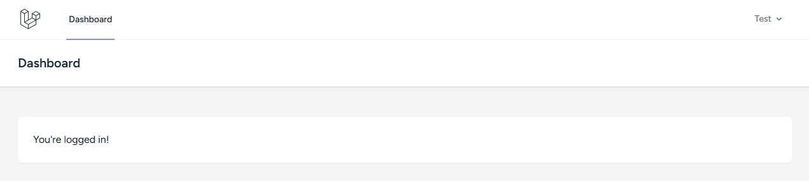

# 🌿 Laravel 12 Breeze Starter

A modern and elegant **Laravel 12** starter project featuring **Breeze (Blade + Tailwind CSS + Alpine.js)**, already configured and ready for real-world development.

This repository serves as a **base template** for new Laravel applications, providing:
- Authentication (Login, Register, Forgot Password)
- User Profile editing
- Dashboard view
- Tailwind CSS + Alpine.js integration
- Vite configuration prebuilt for Laravel 12
- Clean layout and navigation out of the box

---

## 🚀 Quick Start

#### 1. Clone the repository

 ```bash
git clone https://github.com/enrtorgil/laravel12-breeze-starter.git my-new-project
cd my-new-project
 ```

#### 2. Install dependencies
 ```bash
composer install
npm install
 ```

#### 3. Environment setup
Copy and configure your environment file:

 ```bash
cp .env.example .env
php artisan key:generate
 ```

Then edit .env to match your local database credentials:

- DB_CONNECTION=mysql
- DB_DATABASE=laravel
- DB_USERNAME=root
- DB_PASSWORD=

#### 4. Run migrations and seeders

 ```bash
php artisan migrate --seed
 ```

The seeder creates a test user:
- Email: test@example.com
- Password: password

#### 5. Compile assets

For production build:
 ```bash
npm run build
 ```

Or for live development:
 ```bash
npm run dev
 ```

#### 6. Start the application
If using Laragon, Valet, or Sail, open:
 ```bash
http://laravel12-breeze-starter.test
 ```

Otherwise, run:
 ```bash
php artisan serve
 ```

<hr>

- ✅ Laravel 12 (PHP 8.2+)
- 🎨 Tailwind CSS preconfigured
- ⚡ Vite integration
- 🔐 Breeze Auth (Login, Register, Profile)
- 📁 Blade Components for layouts
- 🌗 Modern and minimal UI (Laravel 12 default)
- 🧰 Ready for Docker / Laravel Sail

<hr>

| Layer      | Technology                     |
| -----------| ------------------------------- |
| Framework  | Laravel 12                     |
| Frontend   | Blade, Tailwind CSS, Alpine.js |
| Build Tool | Vite                           |
| Auth       | Breeze                         |
| Database   | MySQL (default)                |
| Language   | PHP 8.2+                       |

<hr>

## ✨ Screenshots
### Página de bienvenida Laravel 12


<hr>

### Dashboard


<hr>

### Profile view


